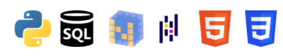
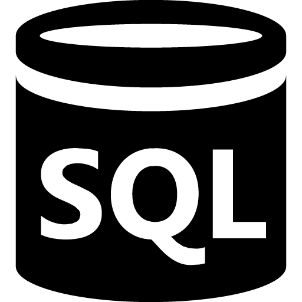

 
<!--
 

&nbsp;&nbsp;
&nbsp;&nbsp; &nbsp;&nbsp;
 &nbsp;&nbsp;&nbsp;
 &nbsp;&nbsp; &nbsp;&nbsp;
&nbsp;&nbsp; &nbsp;&nbsp;
 &nbsp;&nbsp;&nbsp;&nbsp;

 

  

-->
Hi!

 
  
 

  

 <!--
<a href="https://fahricigdem.github.io/prioritized-task-list-with-react/"> My Last React Project (Prioritized Task List App) </a>  
<a href="https://next-js-react-simple-website.vercel.app/"> My NextJS (& React) Project (Simple Website) </a>   

**fahricigdem/fahricigdem** is a ✨ _special_ ✨ repository because its `README.md` (this file) appears on your GitHub profile.

Here are some ideas to get you started:
👯 I’m looking to collaborate   
- 🔭 I’m currently working on ...
- 🌱 I’m currently learning ...
- 👯 I’m looking to collaborate on ...
- 🤔 I’m looking for help with ...
- 💬 Ask me about ...
- 📫 How to reach me: ...
- 😄 Pronouns: ...
- ⚡ Fun fact: ...
-->
